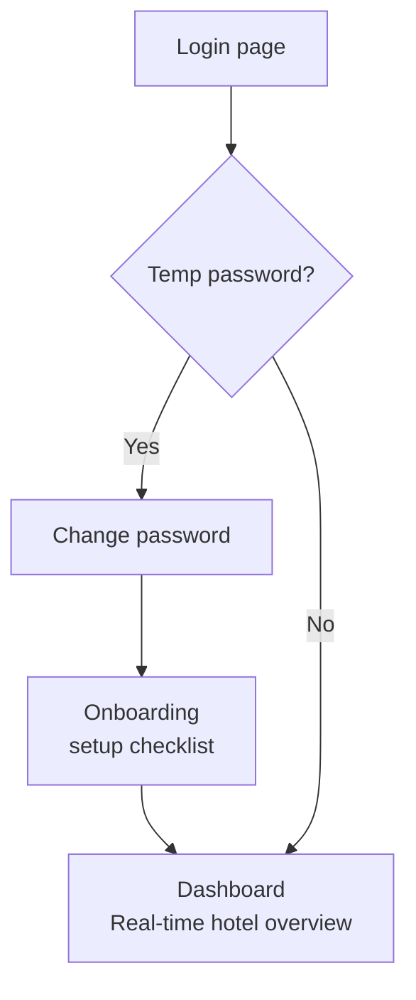

# Admin Workflow

## Authentication & Onboarding

## Feature Modules — all accessible from the sidebar

### Settings
- Hotel profile & logo
- Inventory masters
- Department mgmt.
- Users & roles
- Feature flag config

### Inventory
- Stock entries
- Stock issuances
- Stock requests
- Item drill-down
- Low stock alerts

### Expenses
- Auto purchase entries
- Fixed expenses
- Variable / petty
- Salary tracking
- Month cloning

### Revenue
- Revenue overview
- POS import (CSV/XLSX)
- Column mapping config
- Re-upload handling
- Import history

### P&L Analytics
- Daily P&L
- Weekly view
- Monthly view
- Custom date range
- Year to date

### Reports
- P&L report PDF/Excel
- Expense report
- Inventory report
- Stock request log
- Audit log export
